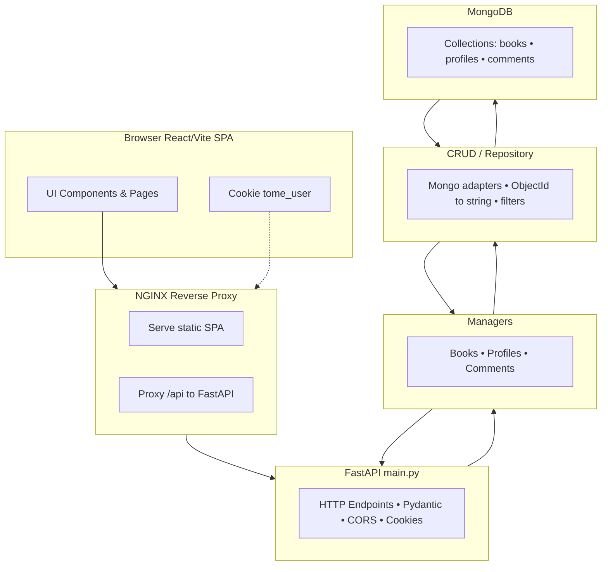

# Tome - Book Review Website

A full-stack application for sharing and discovering book reviews. Built with a modern tech stack featuring Vite + React frontend and FastAPI + MongoDB backend, with cookie-based authentication and comprehensive review management features.

## Features

### Reviews
- **CRUD Operations**: Create, read, update, and delete book reviews
- **Review Fields**: Title, author, genre, year, cover image, and review text
- **Auto-Attribution**: Username automatically pulled from `tome_user` cookie

### Comments
- Add comments on any book review
- **Visual Distinction**: Your comments appear in blue, others in gray
- **Metadata**: Each comment displays username and timestamp
- **Authentication Required**: Must be logged in to comment

### Filtering & Discovery
- **Search**: Find books by title, author, review content, or username
- **Filters**: Author, genre, user, year range, and cover image presence
- **Sorting**: By title (A-Z/Z-A) or year (oldest/newest)
- **Recommendations**: Toggle to sort by most views

### User Features
- **My Reviews**: Toggle to display only your created reviews
- **Profile Modal**: 
  - Access via profile menu or clicking usernames in comments
  - View all reviews by a specific user
  - Quick navigation to individual reviews
  - Close with outside click, Esc key, or ✕ button

### Book Details
- **Expandable View**: Click any book to see detailed information
- **Complete Info**: Title, author, genre, year, review, cover image, views, and ID
- **Graceful Fallbacks**: Handles missing or broken cover images
- **Easy Navigation**: Close with another click or Esc key

### Authentication
- **Cookie-Based Login**: Simple `tome_user=<username>` cookie system
- **Logout**: Clears authentication cookie
- **Profile Menu**: Displays current username
- **Optional Google OAuth**: Configurable via `VITE_GOOGLE_CLIENT_ID`

## Architecture



## Environment Configuration

### Backend Configuration (`backend/.env`)
```env
MONGO_URI=mongodb://mongo:27017/full_life
MONGO_DB_NAME=full_life
MONGO_COLLECTION=books
PORT=8000
```

### Frontend Configuration (`frontend/.env`)
```env
VITE_API_BASE_URL=/api
VITE_APP_ENV=development
VITE_APP_NAME=Tome
VITE_GOOGLE_CLIENT_ID=[your-google-client-id].apps.googleusercontent.com
```

> **Note**: When running frontend and backend separately, set `VITE_API_BASE_URL=http://localhost:8000`

## Quick Start

### Docker (Recommended)
```bash
# Start the full stack
docker compose up --build -d

# Access the application
# - With NGINX proxy: http://localhost:8080
# - Direct Vite access: http://localhost:5173
# - Backend API docs: http://localhost:8000/docs

# Stop the application
docker compose down

# Stop and clear database
docker compose down -v
```

### Local Development

#### Backend Setup
```bash
cd backend
pip install -r requirements.txt
uvicorn main:app --reload --host 0.0.0.0 --port 8000
```

#### Frontend Setup
```bash
cd frontend
npm install
npm run dev
# Visit http://localhost:5173
```

#### Testing Authentication
Set your cookie manually in browser storage:
```
tome_user = yourusername
```

## Development Helper Script

The project includes a convenient `./dev` script to streamline development tasks.

### Basic Commands
```bash
./dev up        # Build & start services, wait until ready, open browser
./dev restart   # Rebuild & restart services
./dev build     # Build Docker images only
./dev down      # Stop and remove containers & network
./dev clean     # Stop containers and remove volumes (clears MongoDB)
./dev logs      # Follow container logs
./dev ps        # Show container status
./dev open      # Open frontend in browser
```

### API Testing Commands
```bash
./dev ping                    # Test backend connectivity
./dev books                   # List all books
./dev get <BOOK_ID>          # Get specific book
./dev delete <BOOK_ID>       # Delete specific book
```

### Creating Books
```bash
# Direct command line
./dev create "Title" "Author" [Year] [Genre] [ImageURL] ["Review"] [Username]

# Using environment variables
BOOK_USERNAME="matt" ./dev create "Help Me" "Matthew Brawders" 2025 "Fantasy" "https://example.com/image.jpg" "Loved it"

# Or set multiple variables
TITLE="PLEASE PLEASE PLEASE" AUTHOR="Matthew Brawders" YEAR=9999 BOOK_USERNAME="matt" ./dev create
```

### Example Workflow
```bash
# Start development environment
./dev up

# Create test data
BOOK_USERNAME="alice" ./dev create "The Great Gatsby" "F. Scott Fitzgerald" 1925 "Fiction"

# View all books
./dev books

# Clean up when done
./dev down
```

## Development Notes

- The application uses cookie-based authentication for simplicity
- MongoDB collections: `books`, `profiles`, `comments`
- CORS is configured for cross-origin requests
- Object IDs are converted to strings for frontend compatibility
- The NGINX proxy serves the React SPA and proxies API requests

---
